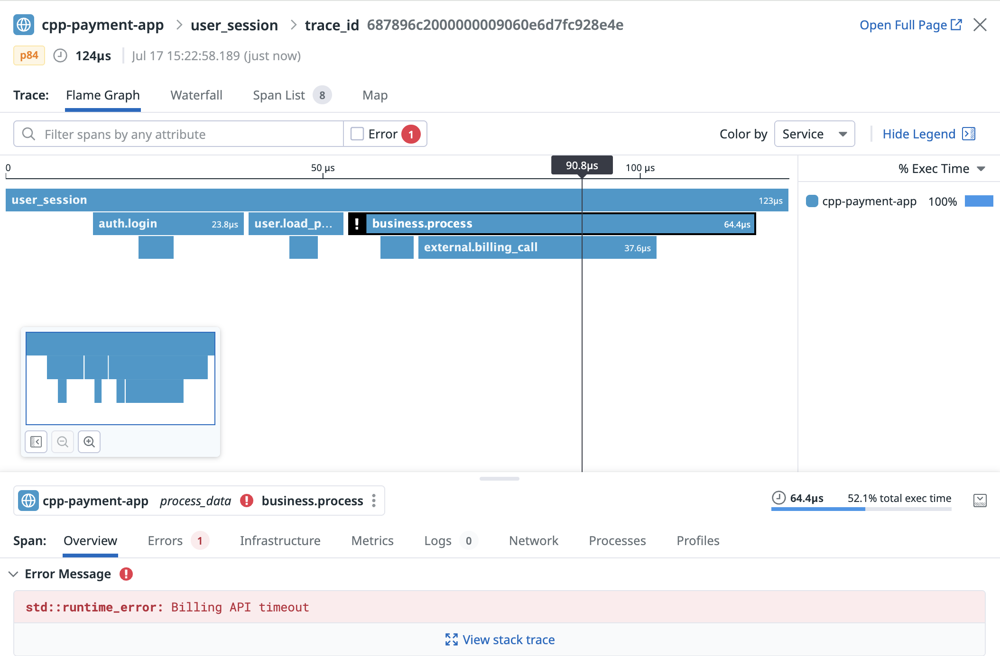

# Datadog APM Tracing with dd-trace-cpp

DatadogのAPM Instrumentation for C++はCustom instrumentationをサポートしております。  
本章では、詳細なInstrumentationの手順をご紹介します。

## 📌 Requirement

- **C++ compiler supporting C++17 or later**

> ℹ️ **Remark**  
> `dd-trace-cpp` v1.0.0 and later requires a C++17-compatible compiler (e.g., GCC 7+, Clang 5+, MSVC 2017+).  
> If your existing codebase uses C++11/14, it must be upgraded to compile under C++17 for integration.

  Requirement: >= C++17 compiler
- **Supported Platforms**  
  x86_64 and arm64 Linux.  
  x86_64 Windows.  
  arm64 macOS.  

## 実行手順

### 1. Tracer(dd-trace-cpp)のダウンロード
```bash
wget https://github.com/DataDog/dd-trace-cpp/archive/v1.0.0.tar.gz -O dd-trace-cpp.tar.gz
```

### 2. Unzip the Tracer
```bash
mkdir dd-trace-cpp
tar zxvf dd-trace-cpp.tar.gz -C ./dd-trace-cpp/ --strip-components=1
```

### 3. Build and install the Tracer
```bash
cd dd-trace-cpp
cmake -B build -DCMAKE_BUILD_TYPE=Release .
cmake --build build -j
cmake --install build
```

### 4. 以下を参照してコードを改修
※tracer_demo.cppをフルコードとして参考可能

#### ①Spanの作成(root span & child span)
```c
{
  // Create a root span for the current request.
  auto root_span = tracer.create_span();
  root_span.set_name("get_ingredients");
  // Set a resource name for the root span.
  root_span.set_resource_name("bologna_sandwich");
  // Create a child span with the root span as its parent.
  auto child_span = root_span.create_child();
  child_span.set_name("cache_lookup");
  // Set a resource name for the child span.
  child_span.set_resource_name("ingredients.bologna_sandwich");
  // Spans can be finished at an explicit time ...
  child_span.set_end_time(std::chrono::steady_clock::now());
} // ... or implicitly when the destructor is invoked.
  // For example, root_span finishes here.
```

#### ②Spanの属性追加(user_id,company_idなど)
 <ローカル定義方式>
 ```c
// Add tags directly to a span by calling `Span::set_tag`
auto span = tracer.create_span();
span.set_tag("key must be string", "value must also be a string");

// Or, add tags by setting a `SpanConfig`
datadog::tracing::SpanConfig opts;
opts.tags.emplace("team", "apm-proxy");
auto span2 = tracer.create_span(opts);
 ```

 <グローバル定義方式>  
1. 環境変数に定義
```bash
export DD_TAGS=team:apm-proxy,key:value
```

2. それから環境変数を利用してコード改修  
```c
datadog::tracing::TracerConfig tracer_config;
tracer_config.tags = {
  {"team", "apm-proxy"},
  {"apply", "on all spans"}
};

const auto validated_config = datadog::tracing::finalize_config(tracer_config);
auto tracer = datadog::tracing::Tracer(*validated_config);

// All new spans will have contains tags defined in `tracer_config.tags`
auto span = tracer.create_span();
```

#### ③ エラー(Exception)定義
```c
span.set_error(true);
//エラーのタグ追加
span.set_error_message("error");
span.set_error_stack("[EBADF] invalid file");
span.set_error_type("errno");
```
### 5. 本RepositoryのExample_Codeには詳細のコード例があり、こちらを参照して、APMで計測したい箇所をコード改修  
　・app_demo.cpp: オリジンプログラム  
　・tracer_demo.cpp: Datadog APMをInstrumentation後のコード  
　・construction.txt: app_demoの呼び出し構造、特に利用する必要はない  

### 6. コードを改修後に再度ビルド、以下はtracer_demo.cppのビルドコマンド例
```bash
g++ -std=c++17 -I/usr/local/include -L/usr/local/lib   -o tracer_demo tracer_demo.cpp   -ldd_trace_cpp-static -lcurl -lpthread -ldl
```

### 7. ビルド後のアプリを実行し、Datadog画面でTraceを確認
```bash
./tracer_demo
```



## 📎 Related Links  
[dd-trace-cpp GitHub Repo](https://github.com/DataDog/dd-trace-cpp)

[Datadog APM Documentation](https://docs.datadoghq.com/tracing/trace_collection/custom_instrumentation/cpp/dd-api?tab=globally)

[Datadog APM instrumentation for C++ Example ](https://docs.datadoghq.com/tracing/guide/setting_up_apm_with_cpp/)

[Datadog APM instrumentation for C++ Compatibility](https://docs.datadoghq.com/tracing/trace_collection/compatibility/cpp/)


